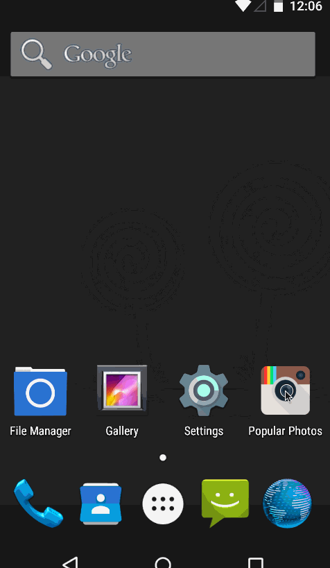

Project 1: Instagram Client
---------------------------

This is a read-only photo viewer for Instagram which allows a user to check out popular photos.

Time spent: 5 hours spent in total

Completed User Stories:
----------------------

- [x] Required: User can scroll through current popular photos from Instagram

For each photo displayed, user can see the following details:
- [x] Required: Graphic, Caption, Username
- [x] Optional: Like count
- [x] Optional: User profile image
- [x] Optional: Relative timestamp
- [x] Optional: Display each user profile image using a RoundedImageView
- [x] Optional: Display a nice default placeholder graphic for each image during loading

Optional Advanced User Stories:
-------------------------------

- [ ] Advanced: Add pull-to-refresh for popular stream with SwipeRefreshLayout
- [ ] Advanced: Show latest comment for each photo (bonus: show last 2 comments)
- [ ] Advanced: Display each photo with the same style and proportions as the real Instagram
- [ ] Advanced: Improve the user interface through styling and coloring
- [ ] Bonus: Allow user to view all comments for an image within a separate screen or a dialog fragment

Walkthrough of all User Stories:
-------------------------------

